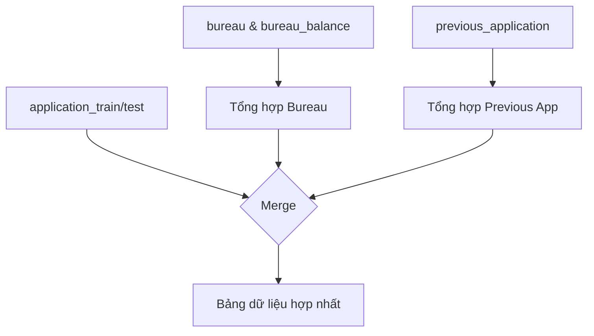

# **Xử lí dữ liệu**

## **Tải dữ liệu (Data Loading)**

Giai đoạn đầu tiên của mọi dự án khoa học dữ liệu là nạp dữ liệu thô vào bộ nhớ một cách hiệu quả. Trong dự án này, quy trình tải dữ liệu được quản lý bởi module `loaders.py`, được thiết kế để xử lý các file CSV lớn một cách tối ưu.

### **Mục đích**

Mục tiêu chính của module này là cung cấp một bộ các hàm chuyên dụng để đọc từng file dữ liệu thô từ bộ dữ liệu Home Credit Default Risk. Chức năng cốt lõi là tải dữ liệu đồng thời tối ưu hóa việc sử dụng bộ nhớ (RAM) ngay từ bước đầu tiên, tạo nền tảng vững chắc cho các bước xử lý tiếp theo.

### **Vấn đề & Giải pháp: Tối ưu hóa Bộ nhớ**

#### Vấn đề

Bộ dữ liệu Home Credit chứa nhiều file CSV với hàng triệu dòng. Nếu sử dụng phương pháp đọc file mặc định của pandas `(pd.read_csv())`, thư viện sẽ tự động suy luận kiểu dữ liệu. Điều này thường dẫn đến việc các cột số được lưu dưới dạng `int64` hoặc `float64` và các cột chuỗi dưới dạng object, chiếm một dung lượng bộ nhớ rất lớn. Với một máy tính cá nhân thông thường, việc này có thể gây tràn bộ nhớ hoặc làm chậm đáng kể toàn bộ quy trình.

#### Giải pháp

Module `loaders.py` giải quyết vấn đề này bằng cách định nghĩa trước kiểu dữ liệu (pre-defining dtypes) cho từng cột trước khi đọc file. Bằng cách chỉ định rõ ràng các kiểu dữ liệu nhỏ hơn nhưng vẫn đảm bảo chứa được toàn bộ dải giá trị, chúng ta có thể giảm dung lượng bộ nhớ sử dụng xuống nhiều lần.

### **Chi tiết Triển khai**

#### **Định nghĩa Kiểu dữ liệu**

Để thực hiện việc tối ưu, loaders.py định nghĩa một dictionary `DTYPE_DICT` chứa thông tin về kiểu dữ liệu cho các cột trong file `application_train/test.csv`.

Biến Phân loại (`CATEGORICAL_COLS`): Một danh sách các cột có tính chất phân loại được định nghĩa trước. Các cột này sẽ được ép kiểu thành 'category', một kiểu dữ liệu đặc biệt của pandas giúp giảm đáng kể dung lượng lưu trữ so với kiểu object (string) mặc định.

Biến Số nguyên (`INT_COLS`): Một danh sách các cột chứa giá trị số nguyên. Chúng được ép kiểu thành `np.int32` hoặc `np.int8` (cho biến `TARGET`), nhỏ hơn so với `np.int64` mặc định.

Biến Số thực: Các cột số thực còn lại (không được định nghĩa trong `DTYPE_DICT`) sẽ được tự động phát hiện và chuyển đổi từ `float64` sang `float32` sau khi tải xong.

```python
# Ví dụ về cách định nghĩa DTYPE_DICT trong loaders.py
# Danh sách các cột object/categorical
CATEGORICAL_COLS = [
    'NAME_CONTRACT_TYPE', 'CODE_GENDER', 'FLAG_OWN_CAR', ...
]

# Danh sách các cột int
INT_COLS = [
    'SK_ID_CURR', 'TARGET', 'CNT_CHILDREN', ...
]

# Tạo dtype_dict cho train/test
DTYPE_DICT = {col: 'category' for col in CATEGORICAL_COLS}
DTYPE_DICT.update({col: np.int32 for col in INT_COLS if col != 'TARGET'})
DTYPE_DICT['TARGET'] = np.int8
```

#### **Xây dựng Hàm Load Dữ liệu**

Module cung cấp một hàm riêng biệt cho mỗi file dữ liệu. Mỗi hàm đều nhận một tham số `nrows` để có thể tải một phần nhỏ của dữ liệu cho việc thử nghiệm và gỡ lỗi (debug).

- `load_application_train(path, nrows)` và `load_application_test(path, nrows)`
- `load_bureau(path, nrows)`
- `load_bureau_balance(path, nrows)`
- `load_previous_application(path, nrows)`
- `load_installments_payments(path, nrows)`

Ví dụ về một hàm loader:

```python
# Trích đoạn từ loaders.py
def load_application_train(path='data/raw/application_train.csv', nrows=None):
    df = pd.read_csv(path, dtype=DTYPE_DICT, nrows=nrows) # Áp dụng DTYPE_DICT
    # Chuyển các cột float64 còn lại sang float32
    for col in df.select_dtypes('float64').columns:
        df[col] = df[col].astype('float32') # Tối ưu hóa thêm
    return df
```

## **Xử lý, Hợp nhất và Tạo biến**

Đây là bước trung tâm và phức tạp nhất trong quy trình dữ liệu, nơi các nguồn thông tin thô được kết hợp, làm sạch và làm giàu để tạo ra một bộ dữ liệu duy nhất, sẵn sàng cho việc mô hình hóa. Toàn bộ logic này được đóng gói trong lớp `DataProcessor` của file `processor.py`.

### **Lớp DataProcessor**

Lớp DataProcessor được thiết kế để điều phối toàn bộ quy trình xử lý dữ liệu. Nó quản lý các trạng thái như chế độ debug (chỉ chạy trên một phần nhỏ dữ liệu), feature engineering và cơ chế caching để tối ưu hóa thời gian chạy.

#### **Debug Mode**

Chế độ debug trong lớp `DataProcessor` được thiết kế để tăng tốc quá trình phát triển và gỡ lỗi bằng cách chỉ xử lý một phần nhỏ của dữ liệu.

Khi được kích hoạt bằng cách khởi tạo `DataProcessor(debug=True)`, quy trình sẽ chỉ tải 10,000 dòng đầu tiên của mỗi file dữ liệu thay vì toàn bộ. Điều này được thực hiện bằng cách truyền tham số `nrows=10000` vào các hàm tải dữ liệu trong `loaders.py`.

Ví dụ sử dụng:

```python
# Chạy nhanh với 10,000 dòng dữ liệu để thử nghiệm
processor_debug = DataProcessor(debug=True)

# Chạy trên toàn bộ dữ liệu (mặc định)
processor_full = DataProcessor(debug=False)
```

Việc này giúp giảm đáng kể thời gian chạy và tài nguyên sử dụng, cho phép kiểm tra logic xử lý một cách nhanh chóng.

#### **Load Dữ liệu**

Phương thức `load_data()` là điểm khởi đầu, thực hiện một quy trình hợp nhất logic để tạo ra một "cái nhìn 360 độ" về mỗi khách hàng.

#### **Luồng xử lý**

- Tải dữ liệu chính: Tải `application_train` và `application_test` bằng các hàm từ `loaders.py`, sau đó kết hợp chúng thành một bảng app duy nhất.

- Xử lý và Tổng hợp các bảng phụ: Trước khi hợp nhất, các bảng dữ liệu phụ được xử lý trước để trích xuất các thông tin có giá trị:

- Dữ liệu Bureau: Phương thức `_load_and_process_bureau()` sẽ nhóm dữ liệu `bureau.csv` theo từng khách hàng (`SK_ID_CURR`) và tính toán các giá trị thống kê như mean, var, min, max cho các cột quan trọng như `DAYS_CREDIT`, `AMT_CREDIT_SUM`.

- Dữ liệu Previous Application: Tương tự, `_load_and_process_previous_apps()` xử lý bảng `previous_application.csv` để tạo ra các biến như `PREV_AMT_CREDIT_mean` (trung bình số tiền vay trong quá khứ).

- Hợp nhất (Merge): Các bảng đã được tổng hợp ở trên được hợp nhất vào bảng app chính thông qua `SK_ID_CURR`.

Sơ đồ Luồng hợp nhất:



#### **Cơ chế Caching**

Để tăng tốc độ cho các lần chạy sau, `DataProcessor` sử dụng cơ chế caching thông minh. Kết quả sau khi hợp nhất và sau khi tạo biến sẽ được lưu lại dưới định dạng `.feather`, giúp giảm thời gian tải dữ liệu từ vài phút xuống chỉ còn vài giây.

- `data/interim/cache_merged.feather`: Lưu kết quả sau khi hợp nhất các bảng.

- `data/interim/cache_fe.feather`: Lưu kết quả sau khi tạo biến.

```python
# Trích đoạn code caching trong processor.py
class DataProcessor:
    def __init__(self, ...):
        # ...
        self.cache_path = 'data/interim/cache_merged.feather'
        
    def load_data(self):
        if os.path.exists(self.cache_path) and not self.force_reload:
            print(f"Đang load cache merge từ {self.cache_path}...")
            return pd.read_feather(self.cache_path)
        # ... (logic xử lý)
        print(f"Lưu cache merge vào {self.cache_path}...")
        app.reset_index(drop=True).to_feather(self.cache_path)
```

### **Feature Engineering**

Đây là phần sáng tạo nhất, nơi kiến thức nghiệp vụ được chuyển hóa thành các biến số mới. Phương thức `auto_feature_engineering()` là nơi thực hiện công việc này.

#### **Các biến tỷ lệ tài chính**

- `CREDIT_TO_ANNUITY`: Tỷ lệ giữa tổng số tiền vay và số tiền trả góp hàng kỳ, có thể phản ánh thời hạn vay.

- `ANNUITY_INCOME_RATIO`: Tỷ lệ giữa tiền trả góp hàng kỳ và tổng thu nhập, cho thấy gánh nặng trả nợ.

- `CREDIT_INCOME_RATIO`: Tỷ lệ giữa tổng số tiền vay và thu nhập, phản ánh mức độ phụ thuộc vào tín dụng.

- `DEBT_OVER_TOTAL_CREDIT`: Tỷ lệ nợ còn lại trên tổng nợ đã vay tại các tổ chức khác, cho thấy tình hình nợ nần hiện tại.

#### **Các biến nhân khẩu học**

- `AGE_YEARS`: Tuổi của khách hàng, được chuyển đổi từ DAYS_BIRTH để dễ diễn giải hơn.

#### **Các biến tương tác**

Các biến kết hợp giữa điểm tín dụng từ nguồn bên ngoài (`EXT_SOURCE_3`) và các chỉ số tài chính chính (`AMT_CREDIT`, `AMT_ANNUITY`...) để tạo ra các thước đo rủi ro mới.

```python
# Trích đoạn từ auto_feature_engineering trong processor.py
if all(col in df.columns for col in ['AMT_CREDIT', 'AMT_ANNUITY']):
    df['CREDIT_TO_ANNUITY'] = df['AMT_CREDIT'] / (df['AMT_ANNUITY'] + 1e-5)

if all(col in df.columns for col in ['AMT_ANNUITY', 'AMT_INCOME_TOTAL']):
    df['ANNUITY_INCOME_RATIO'] = df['AMT_ANNUITY'] / (df['AMT_INCOME_TOTAL'] + 1e-5)

if 'DAYS_BIRTH' in df.columns:
    df['AGE_YEARS'] = (-df['DAYS_BIRTH'] / 365).astype(int)

if 'BURO_AMT_CREDIT_SUM_DEBT_sum' in df.columns and 'BURO_AMT_CREDIT_SUM_sum' in df.columns:
    df['DEBT_OVER_TOTAL_CREDIT'] = df['BURO_AMT_CREDIT_SUM_DEBT_sum'] / (df['BURO_AMT_CREDIT_SUM_sum'] + 1e-5)
```

### **Các bước Hoàn thiện**

#### **Xử lý Giá trị thiếu**

Sau khi tạo biến, phương thức `handle_missing_values()` thực hiện bước làm sạch cuối cùng. Nó điền các giá trị thiếu bằng median cho các cột số và mode cho các cột phân loại, đảm bảo dữ liệu không còn giá trị rỗng trước khi đưa vào mô hình.

```python
# Trích đoạn từ handle_missing_values trong processor.py
numeric_cols = [col for col in df.select_dtypes(include=np.number).columns if col != 'TARGET']
for col in numeric_cols:
    df[col] = df[col].fillna(df[col].median())
```

#### **Làm sạch Tên cột**

Để đảm bảo tính tương thích với các thư viện mô hình hóa như **LightGBM** hay **XGBoost** (vốn nhạy cảm với các ký tự đặc biệt), phương thức `clean_column_names()` sẽ thay thế các ký tự như []<>  trong tên cột bằng dấu _.

```python
# Trích đoạn từ clean_column_names trong processor.py
clean_name = str(col)
clean_name = clean_name.replace('[', '_').replace(']', '_').replace('<', '_')
```