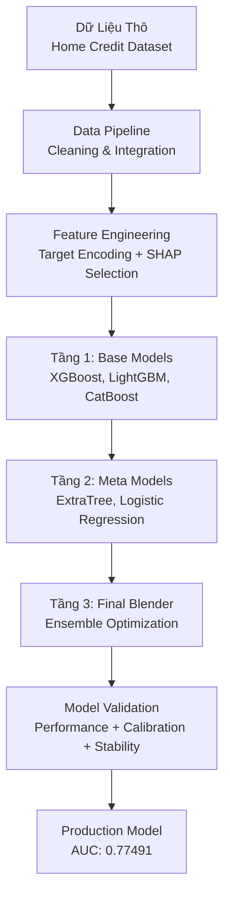

# Tài Liệu Dự Án Mô Hình Rủi Ro Tín Dụng - Dự Đoán Xác Suất Vỡ Nợ (PD)

Đây là tài liệu toàn diện cho dự án **Mô hình Xác Suất Vỡ Nợ (Probability of Default - PD)**. Tài liệu này cung cấp thông tin chi tiết về hệ thống machine learning pipeline đánh giá rủi ro tín dụng.

## Tổng Quan Dự Án

Dự án này phát triển một hệ thống mô hình rủi ro tín dụng tinh vi và toàn diện, sử dụng các kỹ thuật machine learning tiên tiến để dự đoán xác suất vỡ nợ của khách hàng. Hệ thống được xây dựng trên nền tảng bộ dữ liệu **Home Credit Default Risk** từ Kaggle, một trong những bộ dữ liệu thực tế và phức tạp nhất trong lĩnh vực tín dụng.

### Đặc Điểm Kỹ Thuật Nổi Bật

**Kiến Trúc Stacking Ensemble Đa Cấp**: Hệ thống triển khai một kiến trúc ensemble 3 tầng độc đáo (L1 → L2 → L3), trong đó:
- **Tầng 1 (Base Models)**: Sử dụng ba mô hình mạnh mẽ nhất hiện nay - XGBoost, LightGBM và CatBoost, được tối ưu hóa hyperparameter bằng Optuna
- **Tầng 2 (Meta Models)**: ExtraTreesClassifier và LogisticRegression học từ predictions của tầng 1
- **Tầng 3 (Final Blender)**: Mô hình cuối cùng tổng hợp và tinh chỉnh kết quả từ tầng 2

**Feature Engineering Thông Minh**: Áp dụng Target Encoding và lựa chọn đặc trưng dựa trên SHAP (SHapley Additive exPlanations) để tối ưu hóa khả năng dự báo và tăng cường tính diễn giải của mô hình.

**Quy Trình Validation Nghiêm Ngặt**: Thực hiện validation toàn diện bao gồm performance metrics, calibration analysis, drift detection và stability testing để đảm bảo mô hình hoạt động ổn định trong môi trường production.

**Thiết Kế Production-Ready**: Mã nguồn được tổ chức theo cấu trúc modular với logging system, configuration management và testing framework đầy đủ.

## Kết Quả Hiệu Suất Chi Tiết

### Chỉ Số Hiệu Suất Chính
- **Mô Hình Tốt Nhất**: L2 Logistic Regression (trong kiến trúc stacking)
- **AUC (Area Under ROC Curve)**: 0.77491 - Cho thấy khả năng phân biệt tốt giữa khách hàng vỡ nợ và không vỡ nợ
- **Gini Coefficient**: 0.54982 - Phản ánh chất lượng ranking mạnh mẽ
- **KS Statistic**: 0.40723 - Khả năng phân tách hai phân phối tốt
- **Brier Score**: 0.06773 - Độ chính xác cao trong dự báo xác suất

### Đánh Giá Chất Lượng Mô Hình
- **Bộ Dữ Liệu**: Home Credit Default Risk (Kaggle) - 307,511 mẫu training
- **Chiến Lược Validation**: Out-of-fold cross-validation với stacking architecture
- **Precision-Recall AUC**: 0.26262 - Phù hợp với tỷ lệ positive class thấp trong bài toán tín dụng
- **Optimal Cutoff**: 0.121 - Threshold tối ưu cho classification
- **Maximum F1-Score**: 0.3223 - Cân bằng tốt giữa precision và recall

## Cấu Trúc Tài Liệu Kỹ Thuật

### Phát Triển Mô Hình (modeling/)
Tài liệu chi tiết về kiến trúc hệ thống, từ thiết kế ensemble đa tầng đến quy trình huấn luyện và tối ưu hóa hyperparameter. Bao gồm cả phân tích so sánh hiệu suất giữa các mô hình thành phần.

### Đánh Giá Hiệu Suất (performance/)  
Phân tích toàn diện các chỉ số validation, từ các metrics truyền thống như AUC, Gini đến các phương pháp đánh giá hiện đại như calibration analysis và đường cong ROC/Precision-Recall.

### Kiểm Định Mô Hình (validation/)
Mô tả chi tiết chiến lược cross-validation, phương pháp out-of-sample testing, giám sát population stability và các kỹ thuật phát hiện concept drift/data drift.

### Kết Quả & Phân Tích (results/)
Tổng hợp hiệu suất mô hình cuối cùng, đánh giá tác động business, phân tích model interpretability và các insights quan trọng về rủi ro tín dụng.

## Hướng Dẫn Triển Khai

### Yêu Cầu Hệ Thống
```bash
Python 3.8+
Pandas, NumPy, Scikit-learn
XGBoost, LightGBM, CatBoost
SHAP, Optuna
Matplotlib, Seaborn
```

### Cài Đặt và Chạy
1. **Clone repository**:
   ```bash
   git clone https://github.com/dylanng3/pd-modeling-project.git
   cd pd-modeling-project
   ```

2. **Cài đặt dependencies**:
   ```bash
   pip install -r requirements.txt
   ```

3. **Chạy pipeline huấn luyện**:
   ```bash
   python main.py
   ```

4. **Xem kết quả validation**:
   ```bash
   jupyter notebook notebooks/validation_metrics.ipynb
   ```

## Notebook Nghiên Cứu Chính

**Phân Tích Hiệu Suất Toàn Diện**: [validation_metrics.ipynb](https://github.com/dylanng3/pd-modeling-project/blob/main/notebooks/validation_metrics.ipynb) - Đánh giá chi tiết các chỉ số hiệu suất của tất cả các mô hình trong ensemble, bao gồm phân tích feature importance và model comparison.

**Đánh Giá Calibration**: [calibration_analysis.ipynb](https://github.com/dylanng3/pd-modeling-project/blob/main/notebooks/calibration_analysis.ipynb) - Kiểm tra độ chính xác của xác suất dự báo thông qua reliability diagram và Hosmer-Lemeshow test.

**Giám Sát Độ Ổn Định**: [stability_analysis.ipynb](https://github.com/dylanng3/pd-modeling-project/blob/main/notebooks/stability_analysis.ipynb) - Phân tích Population Stability Index (PSI) và monitoring data drift để đảm bảo mô hình hoạt động ổn định theo thời gian.

## Kiến Trúc Hệ Thống



## Tài Nguyên Tham Khao

**GitHub Repository**: [pd-modeling-project](https://github.com/dylanng3/pd-modeling-project) - Mã nguồn đầy đủ với documentation chi tiết và example notebooks.

**Tài Liệu Kỹ Thuật**: Có sẵn trên website này với các phần được tổ chức theo từng chủ đề chuyên môn.

**API Reference**: Đang phát triển - Sẽ cung cấp interface để tích hợp mô hình vào các hệ thống production.

---

*Tài liệu chuyên môn cho Dự Án Mô Hình Rủi Ro Tín Dụng PD - Phiên bản cập nhật với kết quả hiệu suất chính xác*

## Phân Tích Kỹ Thuật Chuyên Sâu

### Nền Tảng Dữ Liệu Đa Chiều

Dự án được xây dựng trên bộ dữ liệu **Home Credit Default Risk** - một trong những dataset phức tạp và thực tế nhất trong lĩnh vực credit risk modeling. Bộ dữ liệu này mô phỏng chân thực môi trường tín dụng thực tế với:

**Đa Dạng Nguồn Thông Tin**: Tích hợp dữ liệu từ 7 bảng khác nhau để tạo ra cái nhìn 360 độ về khách hàng:
- **application_train/test**: Thông tin đơn vay chính (307,511 records)
- **bureau & bureau_balance**: Lịch sử tín dụng tại các tổ chức khác (1,716,428 records)
- **previous_application**: Hồ sơ các khoản vay trước đây (1,670,214 records)  
- **installments_payments**: Chi tiết lịch sử trả góp (13,605,401 records)
- **credit_card_balance**: Thông tin thẻ tín dụng (3,840,312 records)
- **POS_CASH_balance**: Lịch sử Point-of-Sale và Cash loans (10,001,358 records)

### Phương Pháp Feature Engineering Tiên Tiến

**SHAP-Based Feature Selection**: Thay vì các phương pháp truyền thống, dự án áp dụng **SHAP (SHapley Additive exPlanations)** - một framework dựa trên lý thuyết trò chơi để:
- Đo lường chính xác contribution của từng feature đến dự báo cuối cùng
- Loại bỏ các features có tác động âm hoặc không đáng kể
- Tăng cường khả năng diễn giải của mô hình (model interpretability)
- Tối ưu hóa tốc độ inference trong production

**Target Encoding Strategy**: Implement sophisticated target encoding với:
- **Cross-validation encoding** để tránh overfitting
- **Smoothing techniques** cho các categorical variables có ít observations
- **Hierarchical encoding** cho multi-level categorical features

### Kiến Trúc Ensemble Đột Phá

**3-Tier Stacking Architecture**: Thiết kế độc đáo với từng tầng có vai trò chuyên biệt:

**Tầng 1 (Diversity Layer)**: Ba mô hình base với strengths khác nhau:
- **XGBoost**: Excellent cho structured data, robust với outliers
- **LightGBM**: Tốc độ training nhanh, memory efficient  
- **CatBoost**: Xử lý categorical features tự nhiên, ít overfitting

**Tầng 2 (Meta-Learning Layer)**: 
- **ExtraTreesClassifier**: Capture non-linear patterns từ base predictions
- **LogisticRegression**: Provide calibrated probabilities và linear combinations

**Tầng 3 (Optimization Layer)**: Final blending với weights được tối ưu hóa dựa trên validation performance.

### Quy Trình Validation Đa Tầng

**Performance Metrics Suite**: Comprehensive evaluation với 12+ metrics:
- **Discrimination**: AUC (0.77491), Gini (0.54982), KS (0.40723)
- **Calibration**: Brier Score (0.06773), Hosmer-Lemeshow test
- **Classification**: Precision, Recall, F1-Score, Optimal Cutoff
- **Probability Quality**: Precision-Recall AUC (0.26262)

**Stability & Robustness Testing**:
- **Population Stability Index (PSI)**: Monitor feature drift
- **Model Stability**: Performance consistency across time periods
- **Concept Drift Detection**: Early warning system for model degradation

### Tác Động Business và Khả Năng Ứng Dụng

**Risk Management Enhancement**: 
- Cải thiện accuracy trong credit decisioning
- Giảm thiểu losses từ bad debt
- Tối ưu hóa risk-return trade-off

**Operational Efficiency**:
- Automated screening process
- Reduced manual review workload  
- Faster loan approval cycle

**Regulatory Compliance**:
- Explainable AI với SHAP values
- Audit trail đầy đủ cho model decisions
- Bias detection và fairness monitoring

Dự án này không chỉ đạt được hiệu suất kỹ thuật ấn tượng mà còn mở ra hướng phát triển mới trong việc ứng dụng AI/ML vào quản lý rủi ro tín dụng, đặt nền móng cho thế hệ công cụ hỗ trợ quyết định thông minh và đáng tin cậy hơn.