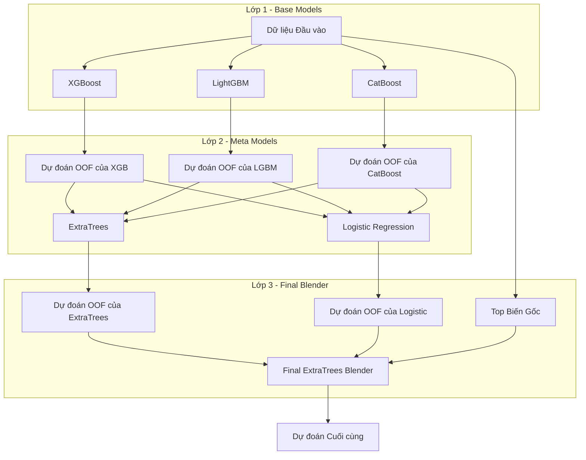

# **Mô hình hóa**

Đây là giai đoạn trung tâm của dự án, nơi "bộ não" dự báo được kiến tạo bằng cách kết hợp các kỹ thuật học máy tiên tiến. Chiến lược được áp dụng không chỉ dừng lại ở việc huấn luyện một mô hình đơn lẻ, mà là một quy trình tinh hoa bao gồm: lựa chọn các biến có giá trị nhất bằng SHAP, xây dựng một kiến trúc Stacking đa lớp để khai thác sức mạnh cộng hưởng từ nhiều mô hình cơ sở, và tinh chỉnh tỉ mỉ từng thành phần bằng kỹ thuật tối ưu hóa tham số tự động với Optuna.

## **Lựa chọn Biến (Feature Selection)**

### **Mục đích**
Sau bước tạo biến (Feature Engineering), tập dữ liệu có thể chứa hàng trăm, thậm chí hàng nghìn biến số. Tuy nhiên, không phải biến nào cũng mang lại giá trị dự báo. Việc đưa tất cả các biến vào mô hình có thể dẫn đến các vấn đề sau:

- Nhiễu (Noise): Các biến không liên quan có thể làm giảm hiệu suất của mô hình.

- Quá khớp (Overfitting): Mô hình có thể học cả những quy luật ngẫu nhiên trên các biến không quan trọng trong tập huấn luyện.

- Tăng thời gian huấn luyện: Càng nhiều biến, thời gian huấn luyện càng lâu.

- Khó diễn giải: Một mô hình với quá nhiều biến sẽ trở nên phức tạp và khó hiểu.

Do đó, mục tiêu của bước này là chọn ra một tập hợp con các biến có sức mạnh dự báo cao nhất để xây dựng mô hình cuối cùng, giúp mô hình trở nên tinh gọn, hiệu quả và đáng tin cậy hơn.

### **Lựa chọn Biến dựa trên SHAP**

Dự án sử dụng **SHAP (SHapley Additive exPlanations)** – một kỹ thuật tiên tiến để đánh giá tầm quan trọng của từng biến một cách chính xác và nhất quán.

### **Lớp FeatureSelector**
Toàn bộ logic lựa chọn biến được đóng gói trong lớp `FeatureSelector`. Lớp này tuân theo quy ước `fit/transform` của scikit-learn.

#### **Quy trình fit()**
Phương thức `fit(X, y)` là nơi quá trình lựa chọn diễn ra, bao gồm các bước sau:

**Bước 1: Chuẩn bị Dữ liệu**
Dữ liệu đầu vào X được làm sạch tạm thời: điền các giá trị thiếu bằng median và làm sạch tên cột để tương thích với XGBoost.

**Bước 2: Huấn luyện Mô hình Phụ**
Một mô hình `xgb.XGBClassifier` được huấn luyện trên toàn bộ dữ liệu. Mô hình này không phải là mô hình cuối cùng của dự án, mà chỉ đóng vai trò là một "công cụ" để SHAP có thể phân tích và giải thích.

```python
# Trích đoạn code huấn luyện mô hình XGBoost trong feature_selector.py
self.model = xgb.XGBClassifier(
    n_estimators=100,
    max_depth=6,
    learning_rate=0.1,
    random_state=self.seed,
    n_jobs=-1,
    eval_metric='auc'
)
self.model.fit(X_filled, y)
```

**Bước 3: Tính toán Giá trị SHAP**
`shap.TreeExplainer` được sử dụng để giải thích mô hình XGBoost đã huấn luyện. Để tối ưu hóa tốc độ, SHAP sẽ chỉ tính toán trên một mẫu con của dữ liệu (mặc định `shap_sample=3000`) thay vì toàn bộ, giúp giảm đáng kể thời gian chờ đợi mà vẫn đảm bảo kết quả tin cậy.

```python
# Trích đoạn code tính toán SHAP trong feature_selector.py
print(f'[SHAP] Starting SHAP values calculation on {len(X_sample)} rows...')

explainer = shap.TreeExplainer(self.model)
shap_values = explainer.shap_values(X_sample)

print('[SHAP] SHAP values calculation completed.')
```

**Bước 4: Xếp hạng và Lựa chọn**
Tầm quan trọng của mỗi biến được tính bằng cách lấy giá trị tuyệt đối trung bình của các giá trị SHAP trên toàn bộ mẫu (`np.abs(shap_values).mean(axis=0)`).

Các biến được sắp xếp theo tầm quan trọng giảm dần, và top k biến (được định nghĩa bởi tham số `top_k`) sẽ được lựa chọn.

```python
# Trích đoạn code xếp hạng và lựa chọn biến trong feature_selector.py

# Tính tầm quan trọng
feature_importance = np.abs(shap_values).mean(axis=0)

# Sắp xếp các chỉ số của biến theo tầm quan trọng giảm dần
sorted_indices = np.argsort(feature_importance)[::-1]

# Lấy top k biến
# ... (logic để lấy top k chỉ số không trùng lặp)


self.selected_features = X.columns[selected_indices]
```

#### **Phương thức transform()**
Sau khi bước `fit()` đã xác định được danh sách các biến tốt nhất, phương thức `transform(X)` sẽ nhận vào một DataFrame và trả về một DataFrame mới chỉ chứa các cột đã được lựa chọn.

### **Ví dụ sử dụng tổng thể**

```python
from src.modeling.feature_selector import FeatureSelector

# Giả sử X_train và X_test là các DataFrame
feature_selector = FeatureSelector(top_k=50, seed=42)

# 1. Học và tìm ra các biến tốt nhất từ tập train
selected_features_list = feature_selector.fit(X_train, y_train)

# 2. Áp dụng để lọc các biến cho cả tập train và test
X_train_selected = feature_selector.transform(X_train)
X_test_selected = feature_selector.transform(X_test)
```

## **Kiểm tra Chất lượng Dữ liệu**

Trước khi đưa dữ liệu vào huấn luyện, việc kiểm tra chất lượng là một bước không thể thiếu để đảm bảo tính toàn vẹn của dữ liệu và ngăn ngừa các lỗi không đáng có trong quá trình mô hình hóa. Module `data_validator.py` cung cấp một hàm `validate_data()` đơn giản nhưng hiệu quả cho mục đích này.

### **Mục đích**
Mục tiêu chính của module này là thực hiện một loạt các bài kiểm tra tự động trên tập dữ liệu đã được xử lý để phát hiện sớm các vấn đề tiềm ẩn. Việc này giúp đảm bảo rằng dữ liệu đầu vào cho mô hình là "sạch", hợp lệ và có ý nghĩa.

### **Chức năng chính: Hàm validate_data()**

Hàm `validate_data(X, y, name="Data")` nhận đầu vào là một DataFrame các biến độc lập (X) và một Series biến mục tiêu (y), sau đó in ra một bản báo cáo tóm tắt về chất lượng của chúng.

Ví dụ sử dụng:
```python

# Giả sử X_train và y_train là dữ liệu đã qua xử lý
from src.validation.data_validator import validate_data

validate_data(X_train, y_train, name="Training Data")
```

#### **Kiểm tra Giá trị thiếu (NaN)**

Thực hiện: Đếm tổng số giá trị rỗng (NaN) trong toàn bộ DataFrame X.

Tại sao quan trọng? Nhiều thuật toán học máy không thể xử lý giá trị NaN và sẽ báo lỗi. Việc xác nhận không còn NaN chứng tỏ bước xử lý giá trị thiếu đã thành công.

#### **Kiểm tra Giá trị Vô cực (Infinity)**

Thực hiện: Đếm số lượng giá trị vô cực (inf) trong dữ liệu.

Tại sao quan trọng? Các giá trị vô cực có thể xuất hiện do các phép chia cho zero và sẽ phá vỡ các phép tính toán trong quá trình huấn luyện mô hình.

#### **Kiểm tra Dải giá trị (Value Range)**

Thực hiện: In ra giá trị nhỏ nhất (min) và lớn nhất (max) trong toàn bộ tập dữ liệu.

Tại sao quan trọng? Giúp nhanh chóng phát hiện các giá trị ngoại lệ (outliers) cực lớn hoặc các giá trị bất thường (ví dụ: giá trị âm cho một biến luôn phải dương), có thể là dấu hiệu của lỗi trong quá trình xử lý.

#### **Kiểm tra Phương sai bằng 0 (Zero Variance)**

Thực hiện: Tìm và đếm các cột mà tất cả các giá trị trong đó đều bằng nhau (phương sai bằng 0).

Tại sao quan trọng? Các biến không có sự thay đổi về giá trị sẽ không mang lại bất kỳ thông tin nào cho mô hình. Việc xác định chúng giúp loại bỏ các "biến rác" và làm cho mô hình tinh gọn hơn.

#### **Kiểm tra Phân phối Biến TARGET**

Thực hiện: Thống kê số lượng của mỗi lớp trong biến mục tiêu y.

Tại sao quan trọng? Giúp đánh giá nhanh mức độ mất cân bằng của dữ liệu (class imbalance). Thông tin này rất quan trọng để lựa chọn chiến lược huấn luyện (ví dụ: sử dụng `class_weight`) và chỉ số đánh giá phù hợp (ví dụ: ưu tiên AUC, PR AUC hơn là Accuracy).


### **Kết quả và Diễn giải**
Dưới đây là kết quả đầu ra khi chạy hàm `validate_data()` và cách diễn giải chúng.
```python
=== Training Data Validation ===
NaN values: 0
Infinity values: 0
Min value: -540000.000000
Max value: 1017957888.000000
Zero variance features: 0
Target distribution: {0.0: 282686, 1.0: 24825}
==============================
```

```python
=== Test Data Validation ===
NaN values: 0
Infinity values: 0
Min value: -356400.000000
Max value: 609164480.000000
Zero variance features: 0
==============================
```

Phân tích kết quả

Kết quả từ `data_validator.py` cho thấy cả tập huấn luyện và tập kiểm tra đều có chất lượng tốt và sẵn sàng cho giai đoạn mô hình hóa.

#### **Tập Huấn luyện (Training Set)**
Toàn vẹn Dữ liệu: Kết quả cho thấy `NaN values: 0 và Infinity values: 0`, khẳng định rằng quy trình xử lý giá trị thiếu (imputation) và các bước làm sạch dữ liệu đã hoạt động hiệu quả. Dữ liệu đầu vào cho mô hình không còn chứa các giá trị có thể gây lỗi.

Chất lượng Biến: `Zero variance features: 0` là một kết quả rất tốt, cho thấy tất cả các biến trong tập dữ liệu đều có sự biến thiên và đều có khả năng mang lại thông tin cho mô hình.

Phân phối Biến mục tiêu: `Target distribution: {0.0: 282686, 1.0: 24825}` xác nhận đây là bài toán phân loại nhị phân với độ mất cân bằng cao (tỷ lệ lớp 0 so với lớp 1 là khoảng 11:1). Điều này củng cố cho quyết định sử dụng các chỉ số đánh giá như AUC và PR AUC thay vì độ chính xác (Accuracy).

#### **Phân tích Tập Kiểm tra (Test Set)**
Tương tự như tập huấn luyện, tập kiểm tra cũng đã vượt qua tất cả các bài kiểm tra chất lượng cơ bản: không có giá trị thiếu, vô cực, hay các biến có phương sai bằng 0.

Điều này đảm bảo rằng quy trình xử lý dữ liệu được áp dụng một cách nhất quán và đồng bộ trên cả hai tập dữ liệu.

**Kết luận tổng thể**: Dữ liệu đã được chuẩn bị một cách cẩn thận và hoàn toàn hợp lệ về mặt kỹ thuật để đưa vào huấn luyện và đánh giá mô hình.

## **Mô hình Cơ sở (Base Models)**

### **Mục đích**

Module `base_models.py` là nền móng của kiến trúc Stacking Ensemble, chịu trách nhiệm huấn luyện các mô hình riêng lẻ ở Lớp 1 (Level 1). Mục tiêu chính là tạo ra một tập hợp các dự đoán đa dạng từ những thuật toán mạnh mẽ khác nhau. Sự đa dạng này là chìa khóa cho sự thành công của mô hình Stacking, vì mỗi mô hình cơ sở có thể học được những khía cạnh và quy luật khác nhau từ dữ liệu.

### **Quy trình Huấn luyện & Tạo Dự đoán OOF**

Mỗi hàm trong module này (ví dụ: `lightgbm_pred`) đều tuân theo một quy trình huấn luyện nghiêm ngặt sử dụng Kiểm định chéo phân tầng (Stratified K-Fold Cross-Validation) để tạo ra hai loại dự đoán quan trọng:

Dự đoán Out-of-Fold (OOF):

- Cách hoạt động: Dữ liệu huấn luyện được chia thành k phần (ví dụ: 5 phần). Mô hình sẽ được huấn luyện trên k-1 phần và đưa ra dự đoán trên phần còn lại. Quá trình này lặp lại k lần, đảm bảo mỗi mẫu dữ liệu trong tập huấn luyện đều được dự đoán một lần bởi một mô hình mà nó chưa từng thấy.

- Tại sao quan trọng? Các dự đoán OOF này sẽ được sử dụng làm biến đầu vào (features) cho mô hình ở Lớp 2. Việc này giúp tránh rò rỉ dữ liệu (data leakage) một cách hiệu quả.

Dự đoán trên tập Test:

- Cách hoạt động: Tại mỗi vòng lặp của cross-validation, mô hình được huấn luyện cũng sẽ đưa ra dự đoán trên toàn bộ tập test. Kết quả dự đoán cuối cùng trên tập test sẽ là trung bình cộng của dự đoán từ k mô hình.

- Tại sao quan trọng? Việc lấy trung bình giúp kết quả dự đoán trên tập test trở nên ổn định và đáng tin cậy hơn.

### **Các Mô hình Cơ sở được sử dụng**
Dự án sử dụng ba thuật toán Gradient Boosting hàng đầu hiện nay làm mô hình cơ sở:

**LightGBM** (`lightgbm_pred`): Nổi bật với tốc độ huấn luyện cực nhanh và hiệu suất cao, đặc biệt hiệu quả trên các tập dữ liệu lớn.

**XGBoost** (`xgboost_pred`): Một thuật toán rất mạnh mẽ và ổn định, thường xuyên giành chiến thắng trong các cuộc thi về khoa học dữ liệu.

**CatBoost** (`catboost_pred`): Xử lý các biến phân loại một cách tự nhiên và hiệu quả, thường cho kết quả rất tốt mà không cần nhiều bước tiền xử lý.

### **Tích hợp Tối ưu hóa Tham số**

Mỗi hàm huấn luyện đều có một tham số `tune_hyperparams`. Khi được bật (`True`), thay vì sử dụng các tham số mặc định, hàm sẽ gọi đến module `tuner.py` để sử dụng Optuna tìm kiếm bộ tham số tốt nhất cho mô hình trước khi huấn luyện. Điều này đảm bảo mỗi mô hình cơ sở đều hoạt động ở mức hiệu suất cao nhất có thể.

Dưới đây là đoạn code trích từ hàm `lightgbm_pred` để minh họa quy trình tạo dự đoán OOF và test.

```python
# Trích đoạn từ base_models.py
def lightgbm_pred(X, y, X_test, ...):
    skf = StratifiedKFold(n_splits=n_splits, shuffle=True, random_state=seed)
    oof_preds = np.zeros(len(X))
    test_preds = np.zeros(len(X_test))
    
    # Vòng lặp cross-validation
    for fold, (train_idx, val_idx) in enumerate(skf.split(X, y)):
        X_train, X_val = X.iloc[train_idx], X.iloc[val_idx]
        y_train, y_val = y.iloc[train_idx], y.iloc[val_idx]
        
        # Tùy chọn: Tinh chỉnh tham số nếu được yêu cầu
        if tune_hyperparams:
            best_params = lightgbm_tuning(X_train, y_train, ...)
            model = lgb.LGBMClassifier(**best_params)
        else:
            model = lgb.LGBMClassifier(**model_params)
        
        # Huấn luyện mô hình và sử dụng early stopping
        model.fit(X_train, y_train, 
                  eval_set=[(X_val, y_val)], 
                  callbacks=[lgb.early_stopping(30)])
        
        # Tạo dự đoán OOF trên tập validation của fold này
        oof_preds[val_idx] = model.predict_proba(X_val)[:, 1]
        
        # Cộng dồn dự đoán trên tập test (sẽ được lấy trung bình sau)
        test_preds += model.predict_proba(X_test)[:, 1] / n_splits
    
    return oof_preds, test_preds, ...
```

## **Hyperparameter Tuning**

### **Mục đích**

Hiệu suất của một mô hình học máy không chỉ phụ thuộc vào thuật toán và dữ liệu mà còn bị ảnh hưởng rất lớn bởi các tham số (hyperparameters) của nó. Việc sử dụng các tham số mặc định thường không mang lại kết quả tốt nhất. Do đó, module tuner.py được xây dựng với mục tiêu tự động tìm kiếm bộ tham số tối ưu cho từng mô hình cơ sở (**XGBoost, LightGBM, CatBoost**), giúp tối đa hóa hiệu suất dự báo.

### **Optuna**
Dự án sử dụng Optuna, một framework tối ưu hóa tham số hiện đại và hiệu quả.

Tại sao lại là Optuna?

- Tìm kiếm thông minh: Optuna sử dụng các thuật toán tìm kiếm tiên tiến (như **Bayesian Optimization**) để nhanh chóng hội tụ về vùng tham số tốt nhất, hiệu quả hơn nhiều so với việc **tìm kiếm ngẫu nhiên (Random Search)** hay **tìm kiếm lưới (Grid Search)**.

- Linh hoạt: Dễ dàng định nghĩa không gian tìm kiếm cho nhiều loại tham số khác nhau.

- Tích hợp dễ dàng: Có thể tích hợp mượt mà vào quy trình huấn luyện hiện có.

### **Chi tiết Triển khai**
Module `tuner.py` cung cấp các hàm riêng biệt để tối ưu hóa cho từng loại mô hình, ví dụ như `xgboost_tuning`, `lightgbm_tuning`, và `catboost_tuning`. Mỗi hàm này đều tuân theo một cấu trúc chung của Optuna:

**Định nghĩa Hàm mục tiêu (objective)**: Đây là hàm cốt lõi, nơi một bộ tham số cụ thể được đánh giá. Bên trong hàm này:

- Không gian Tìm kiếm: Các tham số và dải giá trị của chúng được định nghĩa bằng các phương thức `trial.suggest_*` (ví dụ: `trial.suggest_int`, `trial.suggest_float`). Optuna sẽ thử các giá trị trong các dải này.

- Đánh giá bằng Cross-Validation: Với mỗi bộ tham số được thử, mô hình sẽ được huấn luyện và đánh giá bằng `StratifiedKFold` cross-validation. Chỉ số AUC trung bình trên các fold sẽ là điểm số cuối cùng cho bộ tham số đó.

**Tạo và Chạy study:**

- Một đối tượng study của Optuna được tạo ra với mục tiêu là "maximize" (tối đa hóa) điểm số từ hàm objective.

- Phương thức `study.optimize()` được gọi để bắt đầu quá trình tìm kiếm. Nó sẽ gọi hàm objective nhiều lần (`n_trials`) để tìm ra bộ tham số cho kết quả tốt nhất.

### **Ví dụ Code Diễn giải**
Dưới đây là đoạn code trích từ hàm lightgbm_tuning để minh họa rõ hơn về quy trình.

```python
# Trích đoạn từ tuner.py
import optuna
from sklearn.model_selection import StratifiedKFold
from sklearn.metrics import roc_auc_score
import lightgbm as lgb

def lightgbm_tuning(X, y, seed=42, n_trials=20, n_folds=3):
    # 1. Định nghĩa hàm mục tiêu để Optuna tối ưu hóa
    def objective(trial):
        # 2. Định nghĩa không gian tìm kiếm cho các tham số
        params = {
            'n_estimators': trial.suggest_int('n_estimators', 200, 1000),
            'learning_rate': trial.suggest_float('learning_rate', 0.01, 0.2),
            'max_depth': trial.suggest_int('max_depth', 4, 10),
            # ... các tham số khác
        }
        
        # 3. Đánh giá bộ tham số bằng cross-validation
        skf = StratifiedKFold(n_splits=n_folds, shuffle=True, random_state=seed)
        aucs = []
        for train_idx, val_idx in skf.split(X, y):
            # ... (chia dữ liệu)
            model = lgb.LGBMClassifier(**params)
            model.fit(X_train, y_train, ...)
            preds = model.predict_proba(X_val)[:, 1]
            aucs.append(roc_auc_score(y_val, preds))
            
        # 4. Trả về điểm số trung bình để Optuna tối ưu
        return np.mean(aucs)

    # 5. Tạo và chạy study
    study = optuna.create_study(direction='maximize')
    study.optimize(objective, n_trials=n_trials, show_progress_bar=True)
    
    print("Best params:", study.best_params)
    return study.best_params
```

### **Tích hợp vào Quy trình Mô hình hóa**
Các hàm tuning này được gọi một cách tùy chọn từ trong `base_models.py`. Khi tham số `tune_hyperparams=True` được truyền vào các hàm như `lightgbm_pred`, nó sẽ kích hoạt quá trình tìm kiếm tham số tối ưu này trước khi huấn luyện mô hình cuối cùng trên toàn bộ dữ liệu.

## **Kiến trúc Stacking Ensemble**

### **Tổng quan & Triết lý Thiết kế**

Stacking (hay Stacked Generalization) là một kỹ thuật ensemble tiên tiến, nơi chúng ta xây dựng một mô hình mới để học cách kết hợp các dự đoán từ những mô hình khác một cách tối ưu. Triết lý đằng sau phương pháp này là: mỗi mô hình có thể nắm bắt được những khía cạnh khác nhau của dữ liệu; bằng cách kết hợp chúng một cách thông minh, chúng ta có thể tạo ra một dự đoán tổng thể mạnh mẽ và ổn định hơn.

Tại sao lại là Stacking 3 lớp?

Kiến trúc 3 lớp trong dự án này được thiết kế để tối đa hóa hiệu suất thông qua một quy trình tinh chỉnh đa tầng:

- Lớp 1 (Diversity Layer): Tạo ra sự đa dạng tối đa trong các dự đoán ban đầu bằng cách sử dụng các thuật toán **Gradient Boosting** khác nhau (**XGBoost**, **LightGBM**, **CatBoost**). Mỗi thuật toán có một cách tiếp cận riêng, giúp "nhìn" dữ liệu từ nhiều góc độ.

- Lớp 2 (Combination Layer): Học cách kết hợp các dự đoán đa dạng từ Lớp 1. Lớp này sử dụng các mô hình đơn giản hơn (**ExtraTrees**, **LogisticRegression**) để tránh quá khớp trên các dự đoán đã có, tìm ra trọng số và mối quan hệ tối ưu giữa chúng.

- Lớp 3 (Fine-tuning Layer): Đóng vai trò là một "blender" cuối cùng, tinh chỉnh các tín hiệu từ Lớp 2 và có thể kết hợp thêm các biến gốc mạnh nhất để đưa ra quyết định cuối cùng với độ chính xác cao nhất.

Sơ đồ Kiến trúc Tổng thể
Code snippet



### **Phân tích Từng Lớp**

Module `stacking.py` điều phối toàn bộ quy trình này. Một điểm nhấn quan trọng trong thiết kế là sự tách biệt giữa các lớp thông qua việc lưu trữ kết quả trung gian ra file CSV. Điều này giúp quy trình trở nên modular, dễ dàng chạy lại từng phần và gỡ lỗi.

#### **Lớp 1 (L1) - Các Mô hình Cơ sở**

Mục đích: Tạo ra một tập hợp các dự đoán ban đầu đa dạng và chất lượng cao.

Thực thi: Được quản lý bởi hàm run_l1_stacking().

Các mô hình sử dụng:

```python
L1_MODELS = [
    {"name": "xgb", "func": xgboost_pred, "params": None},
    {"name": "lgbm", "func": lightgbm_pred, "params": None},
    {"name": "catboost", "func": catboost_pred, "params": None},
]
```

Luồng hoạt động: Hàm này lặp qua danh sách `L1_MODELS`, gọi đến các hàm tương ứng từ `base_models.py` để huấn luyện và tạo ra dự đoán Out-of-Fold (OOF). Nó cũng cung cấp tùy chọn `tune_hyperparams` để kích hoạt quá trình tối ưu hóa tham số cho các mô hình này.

Đầu ra: Các file dự đoán OOF và dự đoán trên tập test cho từng mô hình L1, được lưu vào thư mục `models/l1_stacking/`.

#### **Lớp 2 (L2) - Các Siêu Mô hình (Meta Models)**

Mục đích: Học cách kết hợp các dự đoán từ Lớp 1. Các dự đoán của L1 được xem như là "features" mới cho Lớp 2.

Thực thi: Được quản lý bởi hàm `run_l2_stacking()`.

Các mô hình sử dụng:

```python
L2_MODELS = [
    {"name": "extratree", "model": ExtraTreesClassifier(...) },
    {"name": "logistic", "model": LogisticRegression(...) },
]
```

Luồng hoạt động: Hàm này đọc các file dự đoán OOF đã được lưu từ Lớp 1. Sau đó, nó sử dụng `StratifiedKFold` để huấn luyện các meta-model trên các dự đoán này và tạo ra một bộ dự đoán OOF mới cho Lớp 2.

Đầu ra: Các file dự đoán OOF và dự đoán trên tập test cho từng mô hình L2, được lưu vào thư mục `models/l2_stacking/`.

Code Diễn giải (Đọc dự đoán L1):

```python
# Trích đoạn từ run_l2_stacking() trong stacking.py
def run_l2_stacking(...):
    l1_names = ['xgb', 'lgbm', 'catboost']
    # Đọc các file dự đoán OOF đã được lưu từ Lớp 1
    l1_oof = [pd.read_csv(f'models/l1_stacking/l1_{name}_oof_predictions.csv') for name in l1_names]
    
    # Ghép các dự đoán thành một DataFrame features mới cho Lớp 2
    X_l2 = pd.concat(l1_oof, axis=1)
    # ... (huấn luyện các mô hình L2 trên X_l2)
```

#### **Lớp 3 (L3) - Mô hình Tổng hợp Cuối cùng (Final Blender)**

Mục đích: Tạo ra dự đoán cuối cùng bằng cách kết hợp các tín hiệu mạnh nhất từ Lớp 2 và các biến gốc quan trọng nhất.

Thực thi: Được quản lý bởi hàm `run_l3_stacking()`.

Mô hình sử dụng: ExtraTreesClassifier.

Luồng hoạt động: Tương tự Lớp 2, nó đọc các file dự đoán OOF đã lưu từ Lớp 2. Một kỹ thuật nâng cao được áp dụng ở đây là kết hợp thêm các biến gốc (được lựa chọn từ bước Feature Selection) vào tập features của Lớp 3. Điều này cho phép mô hình cuối cùng có thể "nhìn lại" một vài thông tin gốc quan trọng nhất mà có thể đã bị mất đi qua các lớp, giúp tăng cường hiệu suất.

Đầu ra: Mảng dự đoán OOF và dự đoán trên tập test cuối cùng của toàn bộ hệ thống.

Code Diễn giải (Thêm biến gốc vào L3):

```python

# Trích đoạn từ run_l3_stacking() trong stacking.py
def run_l3_stacking(..., raw_feature_names=None):
    # ... (đọc các dự đoán từ L2)
    
    # Tùy chọn thêm các biến gốc vào tập features của L3
    if raw_feature_names is not None and len(raw_feature_names) > 0:
        for feat in raw_feature_names:
            X_l3[feat] = X_train_selected[feat].reset_index(drop=True)
            X_test_l3[feat] = X_test_selected[feat].reset_index(drop=True)
    # ... (huấn luyện mô hình L3 cuối cùng)
```